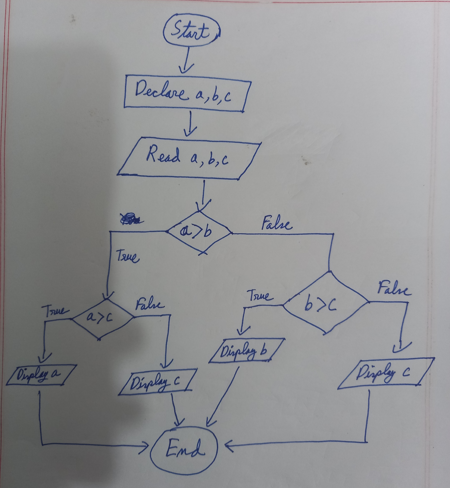

### Golang-এ কন্ডিশনাল স্টেটমেন্ট: সহজে শিখুন! 🚦

Golang-এ **কন্ডিশনাল স্টেটমেন্ট** এমন একটি কৌশল যা প্রোগ্রামকে সিদ্ধান্ত নিতে সাহায্য করে। উদাহরণস্বরূপ, "আপনি যদি বৃষ্টিতে ছাতা না নিয়ে বের হন, তাহলে ভিজে যাবেন!" – এটি একটি কন্ডিশনাল লজিক। এখন আসুন আমরা Golang-এ এটি কীভাবে কাজ করে তা শিখি।

---

### 🛑 কীভাবে কন্ডিশনাল স্টেটমেন্ট কাজ করে?  
গোল্যাং-এ, কন্ডিশনাল স্টেটমেন্ট ব্যবহার করে আমরা প্রোগ্রামকে বলি:  
1. **যদি কিছু শর্ত পূরণ হয়, তবে কিছু করুন।**  
2. **যদি শর্তটি পূরণ না হয়, তাহলে কিছু অন্যকিছু করুন।**

---

<br>
কোডে হাত দেওয়ার আগে আমাদের ২টি গুরুত্বপূর্ণ বিষয় সম্পর্কে জানা উচিত।

#### 1. Comparison Operators  

তুলনা করতে ব্যবহার হয়। ফলাফল *true* বা *false* হবে।  

| অপারেটর | অর্থ                            | উদাহরণ                   |
|---------|---------------------------------|--------------------------|
| `==`    | সমান কিনা                       | `a == b` (a সমান b কিনা) |
| `!=`    | সমান নয় কিনা                   | `a != b` (a সমান নয় b)  |
| `>`     | বড় কিনা                        | `a > b` (a বড় b)        |
| `<`     | ছোট কিনা                        | `a < b` (a ছোট b)        |
| `>=`    | বড় বা সমান কিনা                | `a >= b` (a বড় বা সমান b) |
| `<=`    | ছোট বা সমান কিনা                | `a <= b` (a ছোট বা সমান b) |

---

#### 2. Logical Operators

শর্তগুলো একত্রে চেক করার জন্য।  

| অপারেটর | অর্থ                          | উদাহরণ                              |
|---------|-------------------------------|-------------------------------------|
| `&&`    | AND (উভয় শর্ত true হলে)       | `a > 5 && b < 10`                   |
| `\|\|`    | OR (যেকোনো একটি শর্ত true হলে) | `a > 5 || b < 10`                   |
| `!`     | NOT (শর্ত উল্টে দেয়)          | `!(a > 5)` (a > 5 *false* হলে true) |

---

### Let's Go থুক্কু Let's code

### ১. **if স্টেটমেন্ট**  
`if` হলো সবচেয়ে সহজ কন্ডিশনাল স্টেটমেন্ট। এটি একটি শর্ত পরীক্ষা করে। শর্ত **সত্য (true)** হলে এর পরের কোডটি চালায়।  

```go
if শর্ত {
    // কোডটি চালানো হবে যদি শর্ত সত্য হয়।
}
```
#### উদাহরণ:
```go
package main

import "fmt"

func main() {
    var age int = 18

    if age >= 18 {
        fmt.Println("আপনি ভোট দিতে পারবেন। 🎉")
    }
}
```
উপরের প্রোগ্রামে, যদি age ১৮ বা তার বেশি হয়, তাহলে "আপনি ভোট দিতে পারবেন।" মেসেজটি প্রিন্ট হবে।

---
### ২. if-else স্টেটমেন্ট
যদি if শর্তটি মিথ্যা (false) হয়, তাহলে else অংশটি চালানো হবে।

```go
if শর্ত {
    // কোডটি চালানো হবে যদি শর্ত সত্য হয়।
} else {
    // কোডটি চালানো হবে যদি শর্ত মিথ্যা হয়।
}
```

#### উদাহরণ:
```go
package main

import "fmt"

func main() {
    var age int = 16

    if age >= 18 {
        fmt.Println("আপনি ভোট দিতে পারবেন। 🎉")
    } else {
        fmt.Println("দুঃখিত, আপনি এখনও ভোট দেওয়ার জন্য ছোট। 😢")
    }
}
```

এখানে, যদি age ১৮ বা তার বেশি হয়, তাহলে if অংশটি চলবে। অন্যথায়, else অংশটি চালানো হবে।

---
### ৩. if-else if-else স্টেটমেন্ট
যদি একাধিক শর্ত পরীক্ষা করতে হয়, তাহলে else if ব্যবহার করা হয়।
```go
if শর্ত1 {
    // শর্ত1 সত্য হলে এটি চালানো হবে।
} else if শর্ত2 {
    // শর্ত2 সত্য হলে এটি চালানো হবে।
} else {
    // বাকি সকল ক্ষেত্রে এটি চালানো হবে।
}
```
#### উদাহরণ:
```go
package main

import "fmt"

func main() {
    var marks int = 75

    if marks >= 90 {
        fmt.Println("আপনার গ্রেড: A+ 🎉")
    } else if marks >= 80 {
        fmt.Println("আপনার গ্রেড: A")
    } else if marks >= 70 {
        fmt.Println("আপনার গ্রেড: B")
    } else {
        fmt.Println("আপনার গ্রেড: F 😢")
    }
}
```

উপরের প্রোগ্রামে, আপনার নম্বর (marks) অনুযায়ী গ্রেড দেওয়া হবে। একাধিক শর্তের ভিত্তিতে বিভিন্ন ফলাফল পাওয়া যায়।

---

### ৪. নেস্টেড if স্টেটমেন্ট
if এর ভিতরে আরেকটি if ব্যবহার করা হয়।

#### উদাহরণ:
```go
package main

import "fmt"

func main() {
    var num int = 10

    if num > 0 {
        if num%2 == 0 {
            fmt.Println("সংখ্যাটি একটি পজিটিভ জোড় সংখ্যা। 🎉")
        } else {
            fmt.Println("সংখ্যাটি একটি পজিটিভ বিজোড় সংখ্যা।")
        }
    } else {
        fmt.Println("সংখ্যাটি একটি নেগেটিভ সংখ্যা।")
    }
}

```

উপরের প্রোগ্রামে, প্রথমে চেক করা হচ্ছে num পজিটিভ কিনা। যদি পজিটিভ হয়, তবে চেক করা হচ্ছে এটি জোড় নাকি বিজোড়।

---

### 🎉 কন্ডিশনাল স্টেটমেন্টের মজা 😄😄

এবার আমরা কন্ডিশনাল সেগমেন্ট দিয়ে কিছু বাস্তব জীবনের একটা সমস্যা সমাধান করার চেষ্টা করব।

আমি এখানে ২ সমস্যা দিব এবং তাদের সমাধান করার উপায় বলে দিব। ফ্লো-চার্ট ও কোড সাথে দেওয়া থাকবে। 

আমার পরামর্শ থাকবে প্রথমে নিজে নিজে ফ্লো-চার্টটি তৈরি করার চেষ্টা করুন। তারপর আর্টিকেলে দেওয়া ফ্লো-চার্টের সাথে মিলিয়ে দেখুন। এরপর, তৈরীকৃত ফ্লো-চার্ট অনুযায়ী আগে নিজে নিজে কোড লিখুন। তারপর আর্টিকেলের সাথে মিলিয়ে দেখুন।


#### সমস্যা ১ঃ ৩টা সংখ্যার ভেতর ম্যাক্স বের করা
মনে করুন, আপনার কাছে ৩টা ভ্যারিয়েবল আছে a, b, c. এই তিনটার ভেতর কোনটা সবচেয়ে বড় বের করার উপায় হচ্ছে,

আমরা দেখব a>b সত্য কিনা, 
 - যদি সত্য হয়, তাহলে দেখব a>c সত্য কিনা - 
    - যদি সত্য হয় তাহলে, সবচেয়ে বড় a
    - নাহলে, সবচেয়ে বড় c

নাহলে দেখব, b>c সত্য কিনা -
- যদি সত্য হয় তাহলে, সবচেয়ে বড় b
- নাহলে, সবচেয়ে বড় c

<div style="display: flex; justify-content: center; margin-bottom:20px;">

</div>


```go
package main

import "fmt"

func main() {
	var a int
	var b int
	var c int
	var max int
	fmt.Scan(&a, &b, &c)
	if a > b {
		if a > c {
			max = a
		} else {
			max = c
		}
	} else {
		if b > c {
			max = b
		} else {
			max = c
		}
	}

	fmt.Print(max, " is max\n")
}
```

#### সমস্যা ২ঃ Leap year চেক করা
কোন সাল Leap year কিনা বোঝার উপায় হচ্ছে, 

সেই সালকে ৪ দিয়ে ভাগ করলে যদি মিলে যায়(ভাগশেষ ০ আসে) কিনা -
- যদি মিলে, তাহলে চেক করতে হবে ১০০ দিয়ে ভাগ করলে মেলে কিনা -  
    * যদি মেলে, তাহলে চেক করতে হবে ৪০০ দিয়ে ভাগ করলে মেলে কিনা -
        * যদি না মেলে, তাহলে ***Leap year***.
    * যদি না মেলে, তাহলে ***Leap year***.

<div style="display: flex; justify-content: center; margin-bottom:20px;">

</div>

```go
package main

import "fmt"

func main() {
	var year int
	var isLeapYear bool
	fmt.Scan(&year)
	if year % 4 == 0 {
		if year % 100 == 0 {
			if year % 400 != 0 {
				isLeapYear = true
			} else {
				isLeapYear = false
			}
		} else {
			isLeapYear = true
		}
	} else {
		isLeapYear = false
	}


	if isLeapYear {
		fmt.Print(year, " is a leap year\n")
	} else {
		fmt.Print(year, " isn't a leap year\n")
	}
}

```

---

### 🔑 মনে রাখার টিপস
1. if সবসময় শর্ত চেক করে, শর্ত সত্য হলে কোড চালায়।
2. else শুধুমাত্র তখন চালানো হয়, যখন if শর্ত মিথ্যা হয়।
3. একাধিক শর্তের জন্য else if ব্যবহার করা হয়।

