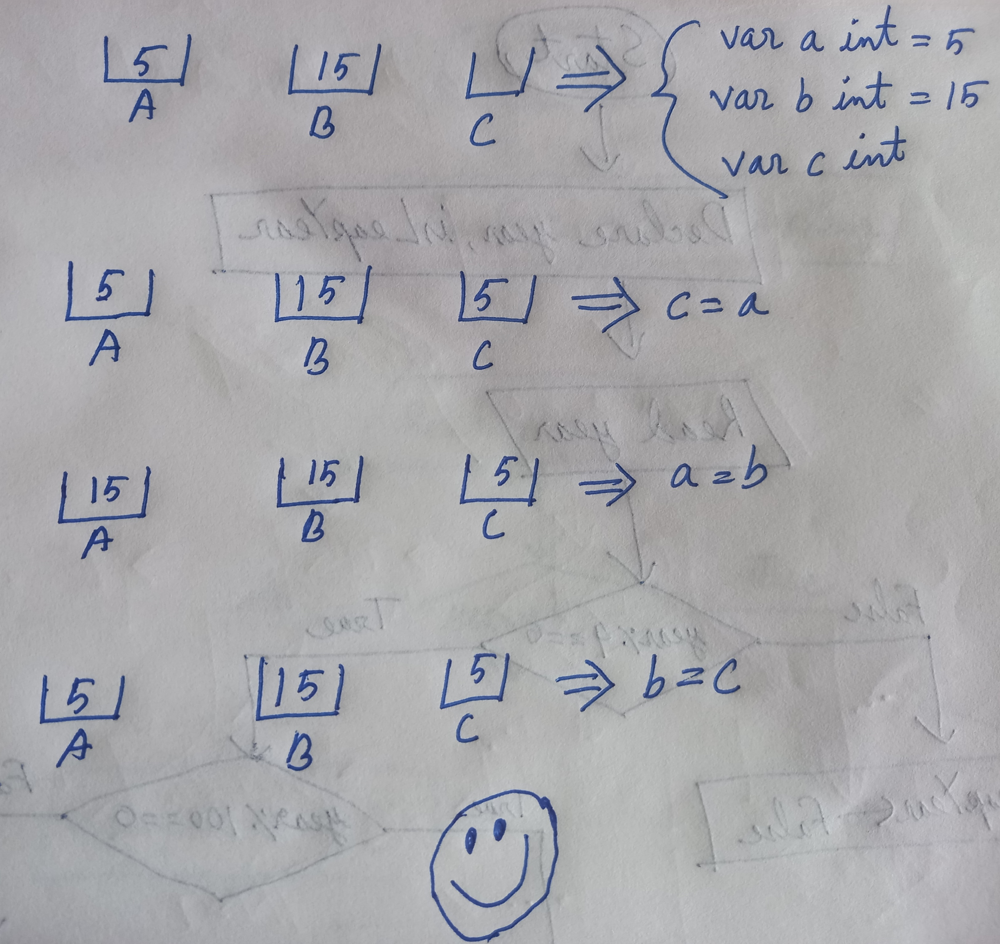

###  🔢 প্রাইমারি ডাটাটাইপ 🎨
প্রোগ্রামিং করার সময় আমরা বিভিন্ন রকমের ডেটা নিয়ে কাজ করব। Golang প্রাইমারি ডাটাটাইপ ৪ রকম:
- `int`: int টাইপ ডেটা মানে হল পুর্ণ সংখ্যা।
- `float32`: দশমিক সংখ্যা এই ডাটাটাইপের অন্তর্ভুক্ত।
- `bool`: এই ডাটাটাইপের ভেতর আসে কেবল true আর false. মূলত, logical operation-এর ভ্যালুগুলো এই ডাটাটাইপের অন্তর্ভুক্ত।
- `string`: সকল প্রকার অক্ষর, শব্দ, বাক্য এর অন্তর্ভুক্ত।

উপরের অংশটা খুব ভালো না বুঝলেও আপাতত সমস্যা নেই। সামনে আস্তে আস্তে ক্লিয়ার হয়ে যাবে।

### ভ্যারিয়েবল 

কম্পিউটারে কোনো ডেটা নিয়ে কাজ করার আগে, সেই ডেটার জন্য RAM-এ একটা memory slot(সেই ডাটার টাইপ অনুযায়ী নির্ধারিত বিট) allocate করতে হয়। এই allocated memory slot-কে আমরা ভ্যারিয়েবল হিসেবে চিহ্নিত করি। ভ্যারিয়েবল আসলে সেই allocated memory slot একটি নাম।

#### ভ্যারিয়েবল declare করার উপায়
>ভ্যারিয়েবল declearation template: var variable_name variable_type.

একটা ছোট্ট উদাহরণ দেইঃ 
```go
package main 

func main() {
    var age int
    age = 25
}
```
১ম লাইনে age নামে একটি ভ্যারিয়েবল declare করা হয়েছে। ২য় লাইনে age নামক ভ্যারিয়েবলে ভ্যালু ২৫ store/assign করা হয়েছে।

ভ্যারিয়েবল declaration এর সময়, `var` কিওয়ার্ড দিয়ে শুরু হয়েছে। এরপর ভ্যারিয়েবিলের নাম age. এরপর ভারিয়েবলের ডাটাটাইপ `int`. এখানে, age ভ্যারিয়েবলের ভেতর সবসময় পুর্ণ সংখ্যা রাখা হবে তাই age এর ডাটাটাইপ `int` দেওয়া হয়েছে।<br><br>
```go
package main 

func main() {
    var cgpa float32
    cgpa = 2.99
}
```
এখানে, প্রথমে float32 টাইপ ডেটা রাখার জন্য cgpa নামের ভ্যারিয়েবল declare করা হয়েছে। তারপর cgpa ভারিয়েবলে 2.99 ভ্যালু assign করা হয়েছে।

আমরা চাইলে ভ্যারিয়েবল declare এবং ভ্যারিয়েবলে ভ্যালু assign  একই সাথে করতে পারি।


```go
package main 

func main() {
    // declare an integer type variable named “age”
    var age int = 25

    // declare a float32 type variable named “cgpa”
    var cgpa float32 = 2.99 // 🥺😭

    // declare a bool type variable named “isCodingFun”
    var isCodingFun bool = true

    // declare a string type variable named “universityName”
    var universityName string = "SUST"
}
```

এখানে `//` দেওয়া অংশকে বলে কোড কমেন্ট করা। কোড কমেন্ট করা মূলত কোডের ভেতরের কোনো অংশের ব্যাখ্যা দেওয়ার জন্য ব্যবহার করা হয়। Program execution-এ এর কোনো ভূমিকা থাকে না।

শর্টকাটে ভ্যারিয়েবল declare করা যায় `:=` ব্যবহার করে। এক্ষেত্রে, Golang ভ্যারিয়েবলের ডেটাটাইপ নিজে থেকেই বুঝে নেয়।

```go
package main 

func main() {
    age := 25
    cgpa := 2.99
    isCodingFun := true
    universityName := “SUST”
}
``` 

### আরও একটু ভ্যারিয়েবলঃ

```go
package main 

func main() {
    var a int = 5
    var b int
    b = a
}
```
এখানে, প্রথম লাইনে আমরা a নামে একটা int টাইপ ভ্যারিয়েবল declare করে তাতে ভ্যালু আকারে ৫ assign করেছি। ২য় লাইনে, আমরা b নামে একটা int টাইপ ভ্যারিয়েবল declare করেছি। তৃতীয় লাইনে, a-তে assign করা ভ্যালু(৫) b-তেও assign করলাম। এখন, a আর b উভয়ের ভ্যালুই ৫।

```go
package main 

func main() {
    var a int = 5
    var b int
    b = a*a
}
```
এখানে, শুধু ৩য় লাইনে আমরা b-এ ২৫(যেহেতু, a এর ভ্যালু ৫। তাই axa মানে ৫x৫=২৫) সেভ করেছি। এখন এর ভ্যালু ৫ আর b এর ভ্যালু ২৫।

```go
package main 

func main() {
    var a int = 5
    var b int = 15
    var c int = a+b
}
```
এখানে, a আর b এর ভ্যালু যথাক্রমে ৫ আর ১৫। c এর ভ্যালু এদের যোগফল ২০।


এবার ছোট্ট একটা কাজ দিয়ে চলে যাব।
```go
package main 

func main() {
    var a int = 5
    var b int = 15
    var c int

    c=a
    a=b
    b=c

    //Now, 15 is stored in a and 5 is stored in b.. But how?? You figure it out
    // At first, you try it out by yourself. Then, look at the figure given below
} 
```

<div style="display: flex; justify-content: center; margin-bottom:20px;">

</div>

### ভ্যারিয়েবল ইনপুট এবং আউটপুটঃ
ইউজারের কাছ থেকে ভ্যারিয়েবলের ভ্যালু ইনপুট এবং ইউজারের কাছে ভ্যারিয়েবলের ভ্যালু আউটপুট দেওয়ার জন্য `fmt` প্যাকেজের ফাংশন যথাক্রমে Scan আর Print. নিচের কোডটি দেখলে বুঝতে সুবিধা হবে।
```go
package main

import "fmt"

func main() {
   var name string
   fmt.Print("Tell me your name: ")
   fmt.Scan(&name)
   fmt.Print("Hello, ", name, "\n")
}
```
উপরোক্ত কোড রান করলে প্রথমেই কমান্ড প্রম্পটে প্রিন্ট করবে ***Tell me your name:&nbsp;***. তারপর নাম ইনপুট নেওয়ার জন্য অপেক্ষা করবে। মনে করুন, ইনপুট দিলেন Chacha Chaudhary. নাম ইনপুট দিয়ে Enter press করলে বলবে, ***Hello, Chacha Chaudhary***

<div style="display: flex; justify-content: center; margin-bottom:20px;">

</div>

`Scan` ফাংশনের সাহায্যে ইনপুট নেওয়ার সময় ভ্যারিয়েবলের সামনে `&` দিতে হয়।

`Print` ফাংশনে ভেতর কথা(টেক্সট) আউটপুট করতে চাইলে সেটাকে ডাবল কোটেশনের ভেতর দিতে হয় আর ভ্যারিয়েবলের ভ্যালু আউটপুট করতে চাইলে সেটাকে সরাসরি লিখে দিলেই হয়।

আর `Print` এর ভেতর প্রতিটা সেগমেন্টকে কমা(,) দিতে আলাদা করে দিতে হয়।  যেমন উপরের কোডে ২য় Print এর ভেতর ৩টা সেগমেন্ট আছে। ২টা টেক্সট,  “Hello ” আর “\n”. আর ১টা ভ্যারিয়েবল, name. এদের প্রতেকে কমা(,) দিয়ে আলাদা করা হয়েছে।

এই আর্টিকেলটা একটু বোরিং মনে হলেও ভালোমত হজম করে নিন। সামনের আর্টিকেলে মজার একটা টপিক নিয়ে কথা বলব। **Roger, over and out..... 🫡**