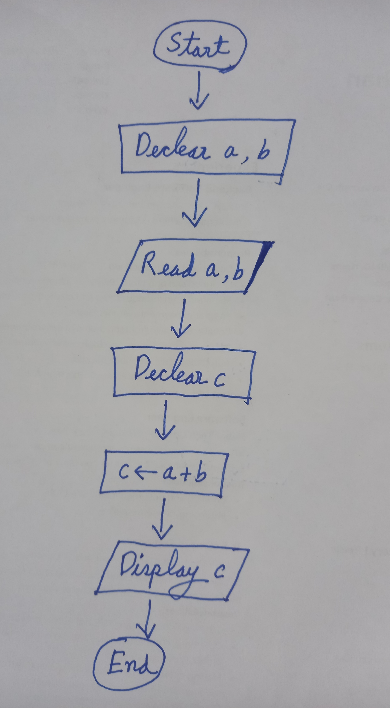

### প্রোগ্রামিং নামক ম্যাজিক! ✨  
প্রোগ্রামিং হলো কম্পিউটারের সাথে কথা বলার ভাষা। 🖥️ আপনি যদি কম্পিউটারকে দিয়ে কোন কাজ করাতে চান, তাহলে কাজটা কিভাবে করতে হবে তার instruction প্রোগ্রামিং ল্যাঙ্গুয়েজের মাধ্যমে কম্পিউটারকে দিবেন। কম্পিউটার আপনার দেওয়া instruction অনুযায়ী কাজটা করে দিবে। 🎩<br>
কোন কাজ সম্পন্ন করার জন্য আপনার দেওয়া instruction(অথবা instruction সেট)-কে প্রোগ্রাম বলে। 💻<br><br>
কম্পিউটারের ৩টা অংশ:<br>
🧠 CPU<br>
📒 প্রাইমারী মেমোরি ইউনিট(RAM)<br>
💾 সেকেন্ডারি মেমোরি ইউনিট(HDD/SSD).<br>
আর CPU (এর ভেতর ALU) হচ্ছে কম্পিউটারের ব্রেইন।
<br><br>
আমরা প্রোগ্রামিং ল্যাঙ্গুয়েজের মাধ্যমে instruction দিলে, CPU সেই instruction অনুযায়ী কাজ করে।
<br><br>
মনে করুন, আপনি এমন একটা প্রোগ্রাম লিখতে চান যা ইউজারের কাছ থেকে ২টা সংখ্যা ইনপুট নিবে, তারপর আউটপুট আকারে তাদের যোগফল প্রিন্ট করে দেখাবে। তাদের instruction গুলো এভাবে দিতে হবে:
- 🖊️ ইউজারের কাছ থেকে ২টা সংখ্যা ইনপুট নেওয়ার পর মেমোরিতে (RAM-এ) রাখার জন্য জায়গা (slot) তৈরি করা। মনে করুন, জায়গা ২টির নাম a আর b.
- 🔢 এরপর ইউজারের কাছ থেকে ২টি সংখ্যা ইনপুট নিয়ে a আর b তে রাখা।
- ➕ ২টি সংখ্যার যোগফল রাখার মতন জায়গা তৈরী করা। মনে করুন, জায়গাটির নাম c.
- ✍️ এবার a আর b তে রাখা সংখ্যা ২টি যোগফল c তে রাখা।
- 📤 c তে রাখা সংখ্যাটি আউটপুট আকারে দেখানো।

নিচের ফ্লোচার্টটি দেখলে বুঝতে কিছুটা সহজ হবে। 🗂️



আমি জানি, আমার মুক্তোঝরা হাতের লেখা দেখে আপনি বিমোহিত। Same old, Same old…. 😎 <br><br>

আমরা যদি উপরোক্ত ফ্লোচার্ট অনুযায়ী, যদি একটা প্রোগ্রাম(Golang, প্রোগ্রামিং ল্যাঙ্গুয়েজের সাহায্যে) লিখি তাহলে তা হবে নিম্নরূপঃ


```go
package main

import "fmt"

func main() {
	// Declare two integer variables a and b
	var a, b int

	// Take input from user and store it into a and b
	// or you can say, read a and b
	fmt.Scan(&a, &b)

	// Declare another integer variable c
	var c int

	// Calculate the sum of a and b and store it in c
	c = a + b

	// Display c
	fmt.Println(c)
}
```
দেখে হিজিবিজি হিজিবিজি লাগছে? 😅<br>
টেনশন করার কিচ্ছু নেই….<br>
এরকম এগুলো আরও অনেক অনেক হিজিবিজি জিনিসপত্র সামনে আসতে চলেছে।<br>
😎 Chill...<br>
🙃 Not really....<br>
😜 Just kidding....<br>
.<br>
.<br>
.<br>
.<br>
Am I ??..... 🤔
<br><br> উপরোক্ত কোডের ব্যাখ্যা এই আর্টিকেলে দিচ্ছি না।
<br>

> 🚨 **Important:** প্রোগ্রামিং ল্যাঙ্গুয়েজের সিনট্যাক্স দেখে ভয়ের কিছু নেই। প্রোগ্রামিং-এর বেসিক বুঝে ফ্লোচার্ট তৈরি করতে পারাটাই প্রোগামিং স্কিল। রেগুলার ১/২ সপ্তাহ সময় দিলেই ল্যাংগুয়েজের সিনট্যাক্স হজম হয়ে যাবে। 🤓

---

### কম্পাইলার আর ইন্টারপ্রেটার (Optional)
যেসব প্রোগ্রামিং ল্যাঙ্গুয়েজে a, b, c, d, .... ইত্যাদি ইংলিশ অক্ষর ব্যবহার করে প্রোগ্রাম লেখা হয়, সেগুলো হাই লেভেল প্রোগ্রামিং ল্যাঙ্গুয়েজ।<br> 
কম্পিউটার বোঝে লো-লেভেল ল্যাঙ্গুয়েজ বা মেশিন ল্যাঙ্গুয়েজ(যা কেবল ০ আর ১ ব্যবহার করে লিখতে হয়), যা মানুষের বোঝার জন্য অনেক কঠিন। 😵<br>
তাহলে, আমাদের লেখা প্রোগ্রাম কম্পিউটারকে খাওয়াবে কে? 🤔<br>
কোন কোন হাই লেভেল প্রোগ্রামিং ল্যাঙ্গুয়েজে জন্য এই কাজ করে কম্পাইলার। যেমনঃ C, C++, Golang.<br>
আবার কোন কোন ল্যাঙ্গুয়েজের জন্য এই কাজ করে ইন্টারপ্রেটার। যেমনঃ পাইথন, জাভাস্ক্রিপ্ট, পিএইচপি। 

👩‍💻 **কম্পাইলার**: 
এটি হাই লেভেল ল্যাংগুয়েজে লেখা কোডকে একবারে ট্রান্সলেট করে লো লেভেল ল্যাংগুয়েজে(পিসির খাওয়ার উপযোগী) নিয়ে আসে।
- **উদাহরণ**:মনে করুন, আপনি ঢাকায় এসে আপনার বন্ধুর বাড়ি উঠবেন। স্টেশন থেকে বন্ধুকে ফোন দিয়ে বললেন, “দোস্ত আমি ট্রেন থেকে নামলাম। এবার বল তোর বাড়ি কোথায় আর কিভাবে তোর বাড়ি যাব।” বন্ধুর কাছ থেকে সব বুঝে নিয়ে তারপর স্টেশন থেকে রওনা হলেন।

👨‍💻 **ইন্টারপ্রেটার**: 
এটি হাই লেভেল ল্যাংগুয়েজে লেখা কোডের প্রতিটা লাইনকে individually ট্রান্সলেট করে লো লেভেল ল্যাংগুয়েজে নিয়ে আসে।
- **উদাহরণ**: এবার মনে করুন, আপনি স্টেশন থেকে নেমে বন্ধুকে ফোন দিলেন। বন্ধু বলল, “তুই মহম্মুদপুর বাসস্ট্যান্ডে এসে আমাকে ফোন দে।” মহম্মুদপুর বাসস্ট্যান্ডে এসে ফোন দেওয়ার পর বলল, "এবার বসিলা রোড ধরে যেতে শুরু কর। ময়ূর ভিলার সামনে এসে আমাকে ফোন দিস।” এরপর ফোন দেওয়ার পর বলল, “এবার রাস্তার ওপারে গিয়ে সাত মসজিদের সামনে এসে আমাকে ফোন দে।” ........................ 😋 

এই কম্পাইলার আর ইন্টারপ্রেটার ব্যাপারটা আপাতত না বুঝলেও চলবে। আমি যে অনেক কিছু জানি এটা বোঝানোর জন্য বললাম আরকি। হি হি…

---

### Golang
এই eBook আমরা প্রোগ্রামিং ল্যাঙ্গুয়েজ, Golang শেখানোর এর মাধ্যমেই প্রোগ্রামিং-এর বেসিক বিষয় নিয়ে ব্যাখ্যা করার চেষ্টা করব।<br>
**কেন Golang?**
1. এটা সহজ। 🐹
2. আমি বর্তমানে এটা নিয়েই কাজ করি 😋

